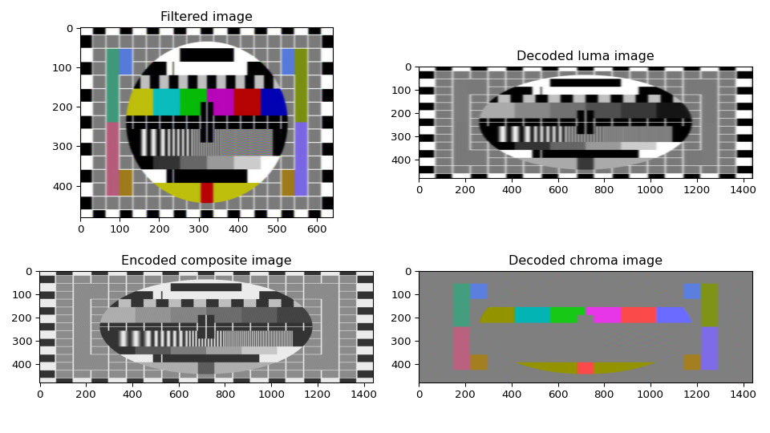
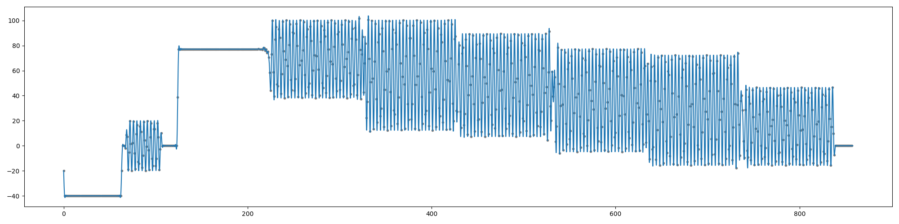
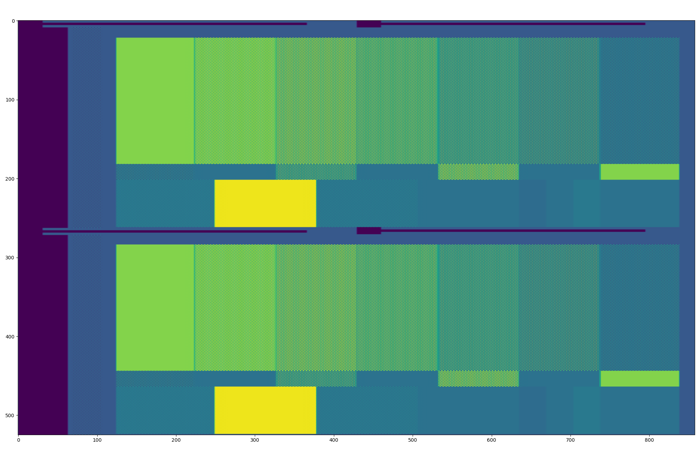
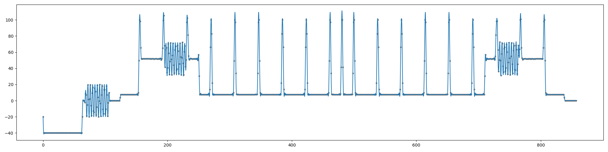
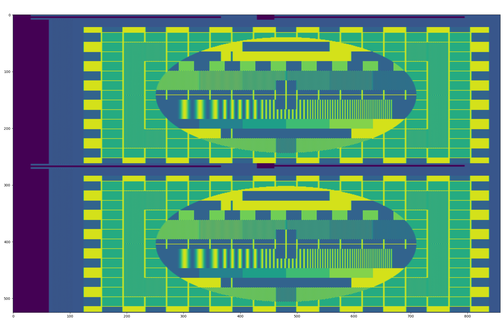
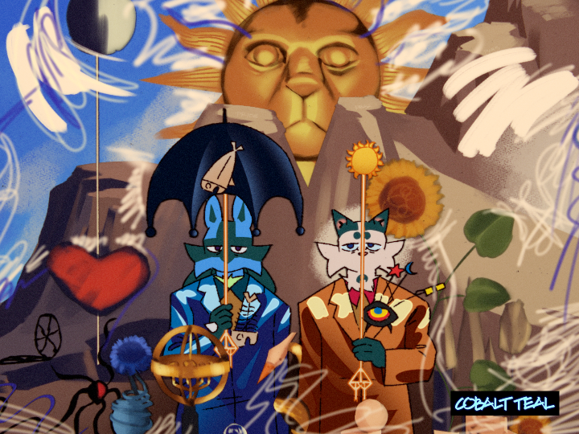
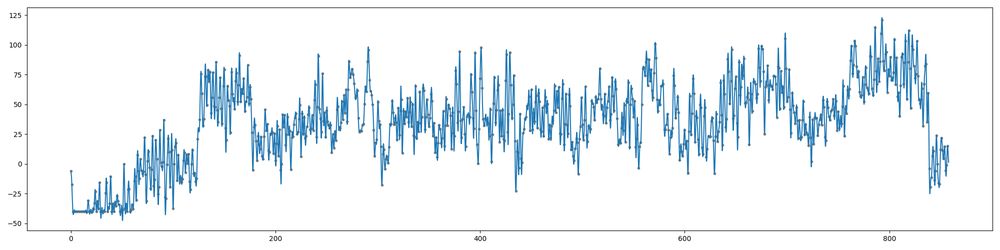
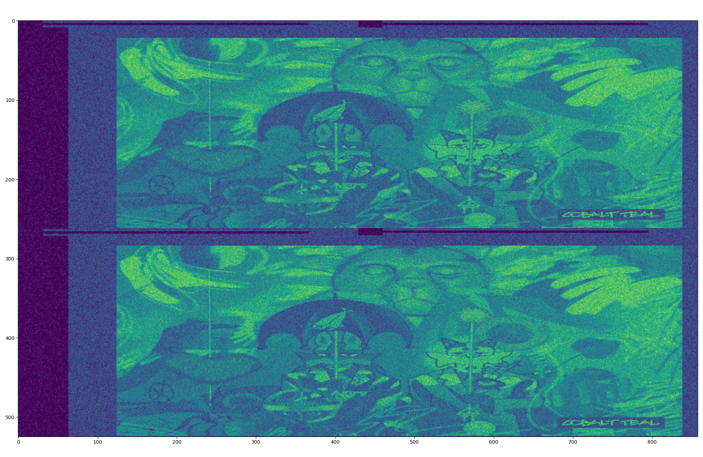
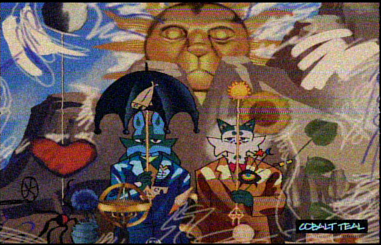

# composite filter

yet another composite filter, in Python



this filter encodes an input image to composite baseband
according to BT.1700. outputs a FLAC-compressed 16-bit signal 
sampled at 13.5MHz.
currently decoding back to RGB is not yet implemented.

## examples

### SMPTE color bars test pattern

taken from [Wikimedia
Commons](https://commons.wikimedia.org/wiki/File:SMPTE_Color_Bars.svg).







### Philips Circle test pattern

taken from [Wikimedia
Commons](https://commons.wikimedia.org/wiki/File:Pm5544_ntsc-2-.png).







### cobalt teal: wind and rain

used with permission.

this example uses the noise parameter of `12.0`.









## requirements and libraries

- see `requirements.txt` for details.

```requirements.txt
matplotlib==3.10.8
numpy==2.4.1
Pillow==12.1.0
scipy==1.17.0
soundfile==0.13.1
```

additionally, vhs-decode must also be installed and in path.

## usage

See `usage.txt` for details, or run `composite_filter.py -h`.

```usage.txt
usage: composite_filter.py [-h] [-q] [-d] [-f] [-pd] [-nl] [-fl]
                           [--plot_scanline PLOT_SCANLINE] [-n NOISE]
                           [-as ACTIVE_SCALE] [--frames FRAMES]
                           [-x {chroma,luma}]
                           input_image

Composite encoder-decoder

positional arguments:
  input_image           input image

options:
  -h, --help            show this help message and exit
  -q, --quiet           Do not print or plot.
  -d, --debug           debug messages
  -f, --flip_field      Switch interlaced fields
  -pd, --prefilter_disable
                        Disables filtering of chroma before encoding.
  -nl, --notch_luma     Notch filters luma at colorburst to prevent crosstalk
                        in simpler Y/C decoders.
  -fl, --fsc_limit      Limit frequency content to colorburst.
  --plot_scanline PLOT_SCANLINE
                        Plot specified scanline. Default = 143
  -n NOISE, --noise NOISE
                        Sigma of gaussian noise to add to the signal, in units
                        of IRE. Default == 0.0
  -as ACTIVE_SCALE, --active_scale ACTIVE_SCALE
                        Compensated active video width, in samples. Default =
                        None.
  --frames FRAMES       Number of whole frames to render (or, x2 fields).
                        Default == 2
  -x {chroma,luma}, --disable {chroma,luma}
                        Disables chroma by setting UV to 0. Disables luma by
                        setting Y to 0.5.

version 0.4.0
```

additionally, [vhs-decode and ld-tools](https://github.com/oyvindln/vhs-decode) are used to generate decoded image examples.

## license

This work is licensed under the MIT-0 license.

Copyright (C) Persune 2026.

## credits

Special thanks to:

- NewRisingSun
- lidnariq
- Kagamiin
- PinoBatch
- LMP88959
- Stephen Neal and Harry from Domesday86

Dedicated to yoey and _aitchFactor

This would have not been possible without their help!
