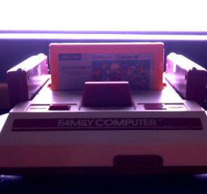
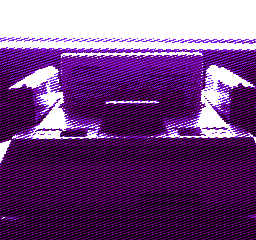

# Ditherer

dithers an input image using an input dither mask and an input palette. not very efficient.

## About

it was difficult doing dithering in GIMP so i caved in and made a python script instead.

most of it based on https://bisqwit.iki.fi/story/howto/dither/jy/ \
equations from http://brucelindbloom.com/index.html?Math.html

## Example



This image was generated with the following arguments:

```
ditherer.py masks\n8m5.png fami.png -pal #000000 #61006d #8220f6 #ffffff -gam 1.5
```

## [License](../LICENSE_MIT-0.txt)

This implementation is licensed under MIT-0.
Copyright 2025 Persune.
